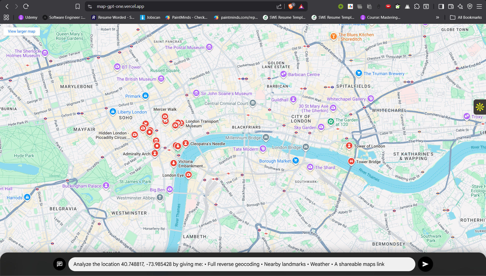
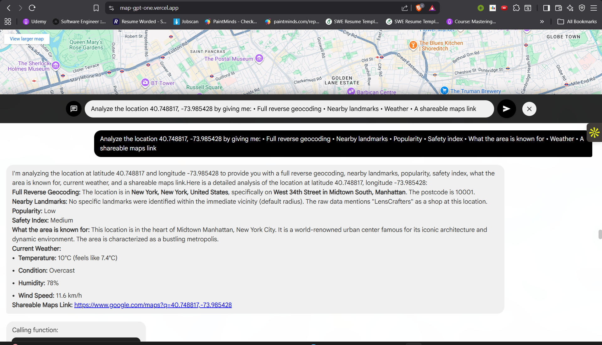

# MapGPT MCP 

A high-performance mapping application built with modern web technologies, providing real-time geospatial visualization and interaction capabilities.
This project transforms raw map coordinates into rich, human-level insights including:  
- nearby landmarks  
- popularity  
- safety  
- weather  
- area profile  
- shareable location links  
- natural language geo-search  
- intelligent reasoning and recommendations


## 🚀 Features

- 🗺️ Live Location Sharing with real-time updates.
- ⚡ Real-time chatting with Maps
- 📱 Responsive design for all devices
- 🔒 Secure and scalable architecture
- 🐳 Docker container support
- 🔄 Built with Vite for fast development and optimized production builds

## 🛠️ Screenshots





## 💬 Example Prompts

### 1. Natural Language Geo-Search
Ask for places, categories, rankings, or filters.
- Locate me Prayagraj in Map.
- Find the top restaurants within 2km of Connaught Place, New Delhi.
- Show me all hospitals within 5km of IIT Delhi that are open right now.
- Find cafés near HSR Layout with ratings above 4.2 and outdoor seating.

### 2. Reverse Geocoding with AI Summary
Get full location insights: address, POIs, popularity, safety, and area profile.
- Give me reverse geo insights for latitude 28.6139 and longitude 77.2090.
- What important landmarks and points of interest are near 12.9716, 77.5946? Also summarize the area.
- Tell me how popular this area is and how safe it usually is:
  lat: 19.0760, lng: 72.8777
- Generate a short profile of the neighborhood around 40.7128, -74.0060 with landmarks, popularity and what it's known for.

### 3. Location Sharing Utilities
Generate shareable map links and descriptions.
- Generate a shareable location link for coordinates 28.7041, 77.1025.
- Share this location with a label and one-line description:
  lat: 51.5074, lng: -0.1278

### 4. Weather at Location
Ask for real-time weather, summarized conditions, or weather-based reasoning.
- Get the current weather for latitude 28.5355 and longitude 77.3910.

### 5. Combined Full-Feature Prompts
These showcase the complete intelligence pipeline.
- Analyze the location 40.748817, -73.985428 by giving me:
  • Full reverse geocoding
  • Nearby landmarks
  • Popularity
  • Safety index
  • What the area is known for
  • Weather
  • A shareable maps link

- Create a complete geo-intelligence report for coordinates 25.276987, 55.296249 with POIs, AI summary, shareable link, and current weather.

- Compare the area around 12.9716, 77.5946 with 28.7041, 77.1025 in terms of landmarks, popularity, weather, and what each region is known for.


## 🛠️ Prerequisites

- Node.js 18+
- npm 9+ or yarn 1.22+
- Docker 20.10+ (optional)
- Google Maps API key


## 🚀 Quick Start

### Local Development

1. Clone the repository:
   ```bash
   git clone https://github.com/yourusername/mapgpt.git
   cd mapgpt
   ```

2. Install dependencies:
   ```bash
   npm install
   ```

3. Create a `.env.local` file with your configuration:
   ```env
   VITE_GOOGLE_MAPS_API_KEY=your_google_maps_api_key
   ```

4. Start the development server:
   ```bash
   npm run dev
   ```
   Open [http://localhost:5173](http://localhost:5173) to view it in your browser.

### Docker Setup

1. Build the Docker image:
   ```bash
   docker build -t MapGPT .
   ```

2. Run the container:
   ```bash
   docker run -p 3000:3000 --env-file .env.local MapGPT
   ```
   The application will be available at [http://localhost:3000](http://localhost:3000)

## 📂 Project Structure

```
mapgpt/
├── src/                    # Source files
│   ├── components/         # Reusable UI components
│   ├── services/           # API and service integrations
│   ├── types/              # TypeScript type definitions
│   └── utils/              # Utility functions
├── public/                 # Static assets
├── .env.local              # Environment variables (not versioned)
├── index.html              # Main HTML file
├── vite.config.ts          # Vite configuration
└── tsconfig.json           # TypeScript configuration
```

## 🧪 Available Scripts

- `npm run dev` - Start development server
- `npm run build` - Build for production
- `npm run preview` - Preview production build locally
- `npm run lint` - Run linter
- `npm run type-check` - Run TypeScript type checking

## 🔧 Environment Variables

| Variable | Description | Required |
|----------|-------------|----------|
| `VITE_GOOGLE_MAPS_API_KEY` | Google Maps JavaScript API key | Yes |
| `VITE_API_BASE_URL` | Base URL for API requests | No |

## 🐳 Docker Deployment

### Production Build

```bash
docker build -t mapgpt:latest .
```

### Run with Environment Variables

```bash
docker run -d \
  --name mapgpt \
  -p 3000:3000 \
  --env-file .env.production \
  mapgpt:latest
```

### Docker Compose

Create a `docker-compose.yml` file:

```yaml
version: '3.8'

services:
  mcp-maps:
    build: .
    ports:
      - "3000:3000"
    env_file:
      - .env.production
    restart: unless-stopped
```

Then run:
```bash
docker-compose up -d
```

## 🤝 Contributing

1. Fork the repository
2. Create your feature branch (`git checkout -b feature/amazing-feature`)
3. Commit your changes (`git commit -m 'Add some amazing feature'`)
4. Push to the branch (`git push origin feature/amazing-feature`)
5. Open a Pull Request

## 📄 License

This project is licensed under the MIT License - see the [LICENSE](LICENSE) file for details.

## 📬 Contact

For questions or feedback, please open an issue or contact the maintainers.

---

<div align="center">
  Made with ❤️ by Priyanshu Yadav 
</div>
